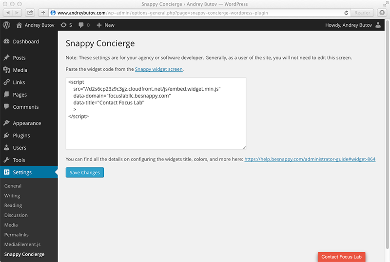
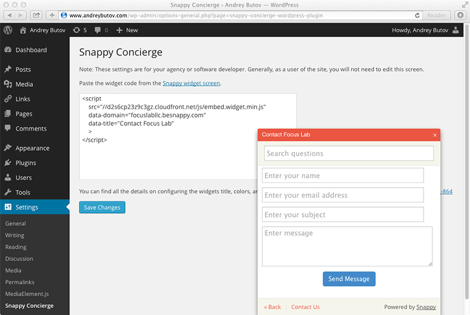

# Snappy Concierge for Wordpress

More than ever agencies, consultants and freelancers need a better way to support their long term and retainer customers.

With Concierge you can deliever more to your customers than a CMS. By integrating the [Snappy](http://besnappy.com) widget directly into the sites you create, customers will always have a uniform and clear channel of contact with you.

[Learn more about Snappy Concierge](http://besnappy.com/concierge)

Here you can see the tab embedded into the WordPress admin as well as where the widget code from Snappy needs to be placed.

This is what the widget looks like when it's open.

## Wordpress Plugin Specs
* Contributors: userscape
* Requires at least: 3.8.0
* Tested up to: 3.9.0
* Stable tag: 1.1
* License: GPLv2 or later
* License URI: http://www.gnu.org/licenses/gpl-2.0.html

Snappy Concierge makes it easy for agencies and consultancies to organize ongoing change and support requests across multiple clients.

## Plugin Description

Concierge makes it easy for agencies and consultancies to organize ongoing change and support requests across multiple clients.
Leave your Concierge calling card on every site you deliver. Simple, Streamlined, Consistent.

The free Snappy Concierge plugin makes it easy to embed the powerful Snappy widget into Wordpress for every site you deliver to clients. From there, the client has an always-open doorway to your FAQ and contact form, and you have a streamlined, organized dashboard for incoming requests.

Say goodbye to lost emails, delayed responses, and an inbox full of “unread” messages from clients. Snappy Concierge collects all your messages and support inquiries, from all your delivered sites, and brings them to you in one simple dashboard.

Note: A [Snappy](http://besnappy.com) account is required. 

## Installation

1. Upload `plugin-name.php` to the `/wp-content/plugins/` directory
2. Activate the plugin through the 'Plugins' menu in WordPress
3. Insert the Snappy Widget code in the plugins settings

## FAQ

### Do I need a Snappy account?

Yes, you can sign up here: [Snappy Customer Support Software](http://besnappy.com)

## Changelog

### 1.1
* The plugin now automatically pre-populates the Snappy widget with the name and email of the logged-in Wordpress user.

### 1.0
* Release!

